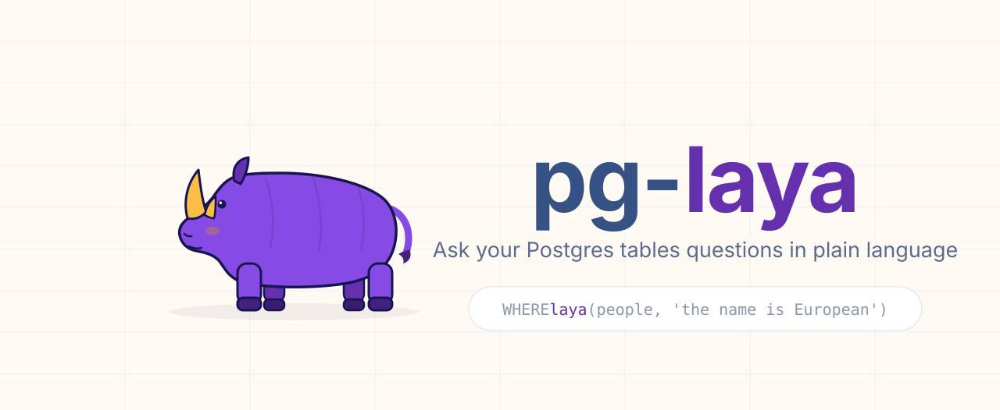

<p align="center">
  
</p>

# laya — ask your Postgres tables questions in plain language

[](https://github.com/realZachi/pg-laya/actions/workflows/ci.yml)
[](https://pgxn.org/dist/laya/)
[](LICENSE)
[](https://pglaya.com)

Write the condition the way you would say it. Postgres does the rest.

`laya` lets you filter, rank and classify rows with plain-language conditions. Every row is judged by
[Laya](https://github.com/NandhaKishorM/laya), a local, non-autoregressive System-1 model that returns
calibrated probabilities instead of generated text. No index, no embeddings, no vector column.

The model is pluggable over the `/v1/systemone` protocol: by default every row is judged by a local
companion model server on the same machine — [Ollaya](https://ollaya.dev) on
`http://127.0.0.1:11435`, installed by `make install` — and `laya.api_url` can point at the cloud
[TypeSafe Jev](https://docs.typesafe.ai) model instead (same wire protocol, no code change). A loaded
model runs one inference at a time, so keep `laya.concurrency` low (2-4).

Website: [pglaya.com](https://pglaya.com)

```sql
CREATE EXTENSION laya CASCADE;

SELECT * FROM people WHERE laya(people, 'the name is European');

SELECT subject, laya_prob(tickets, 'the customer is angry') AS p
FROM tickets ORDER BY p DESC LIMIT 20;

SELECT laya_choice(tickets, 'which team should handle this?',
                  ARRAY['billing', 'technical', 'security', 'sales']) AS team, count(*)
FROM tickets GROUP BY 1;

SELECT name, laya_score(products, 'how luxurious is this product?',
                       ARRAY['budget', 'mid-range', 'premium', 'luxury']) AS luxury
FROM products ORDER BY luxury DESC;
```

`laya()` is an ordinary boolean function, so it composes with everything else in SQL: `AND age > 40`,
joins, `GROUP BY`, `LIMIT`, `ORDER BY laya_prob(...)`.

## How it works

1. `laya(table, 'condition')` receives the row as a composite value. The first call for a table + condition starts a
   read-ahead that streams the table in physical order (TID range scans; `OFFSET` pages for views), so memory stays
   constant whatever the table size.
2. Rows are packed `laya.batch_size` (20) per request into one shared *state*
   (`{"condition": ..., "rows": [...]}`) with one yes/no [Noul](https://docs.typesafe.ai/primitives/noul)
   question per row. Laya evaluates all questions over one state in a single forward pass, which amortises
   the ~270-token request overhead (about 435 tokens for one row alone vs 175 per row in batches of 20).
   That is the default `jev` state format — what the cloud Jev model was built for. With the local server,
   `SET laya.state_mode = 'native'` instead sends the row itself as the state with the condition in the
   question, one row per request: the shape the local model is trained on (it cannot reliably separate
   rows in a shared state, so `laya.batch_size` is ignored in this mode).
3. Up to 2 × `laya.concurrency` requests are in flight over persistent HTTPS connections, and every row is answered
   as soon as its batch returns, so a `LIMIT` stops the read-ahead after the in-flight window, and rows that cheaper
   predicates filter out before `laya()` runs (`WHERE age > 60 AND laya(...)`) are skipped rather than judged.
4. Answers are cached per row content for the session, so re-running, changing the threshold or sorting by
   probability is free. Rows from a subquery or CTE (anonymous `record` type) can't be read ahead and are judged
   one request at a time; put `laya()` on base tables or views when you can.

Measured against the cloud Jev API on a 2,000-row table from Europe (~190 ms to the API): first run ≈ 3.5 s in
100 requests, ≈ 296k input tokens, ≈ $0.012; second run ≈ 50 ms; `LIMIT 3` on a new condition ≈ 0.6 s. A new
condition in a session that still holds its pooled connections (idle for less than `laya.keepalive`) takes
≈ 2.3 s: the first request on each fresh connection is the slow one. Version 0.1.0 needed 8.5 s (and 338k
tokens) for the full query and 8.4 s for the `LIMIT`. Against the local server the same numbers are local
inference time instead of network round trips.

### Why 20 rows per request

This is about the cloud Jev model in the default `jev` state format. The local Laya model is the
opposite case: it judges one record per request and smears answers across rows in a shared state,
so use `laya.state_mode = 'native'` with it (one row per request). For Jev, the model has to find
`rows[i]` by position in the array, and that gets unreliable in long arrays. Against
ground truth from structured columns (job title, EU membership, a phrase in a free-text field; 400 rows
each), batches of 1–20 rows were 100 % correct, batches of 40 were 92–98 % and batches of 80 were 77–94 %.
Wider rows (1,000 characters) made no difference at 20. Naming rows instead of indexing them did not help.
Batches of 20 cost 4 % more tokens than batches of 40 and are just as fast, because a request's latency
barely depends on its size.

## Install

Requirements: PostgreSQL 14–17 with `plpython3u` (package `postgresql-plpython3-NN` on Debian/Ubuntu,
included in the EDB and Postgres.app builds), and a superuser. The Laya model runs in a companion model
server ([Ollaya](https://ollaya.dev), a single binary) on the same machine, so no cloud API key is
required. `make install` installs the extension **and** the model server as a system service (that part
needs `curl` — no Python, nothing to compile). Managed hosts that withhold superuser or `plpython3u`
(Supabase, Neon, RDS, …) cannot run it; see
[Where it runs](https://pglaya.com/docs/getting-started/where-it-runs).

### The Ollaya model server

`laya` talks to a local model server by default, and `make install` sets it up for you: it installs
[Ollaya](https://ollaya.dev) — a single binary that serves the Laya decision models over a
TypeSafe-compatible `/v1` API — and starts it as a system service: a systemd unit (`ollaya.service`)
on Linux, a launchd agent (`com.pglaya.ollaya`) on macOS, bound to `http://127.0.0.1:11435`, where the
extension's default `laya.api_url` points. It then pulls the `laya` model (a router over `laya:en` /
`laya:multilingual`, ~1.5 GB, sha256-verified, resumable) into the server's model store
(`~/.ollaya/models`). In containers and CI there is no service manager, so it prints how to start the
server by hand instead. `NO_SERVE=1 make install` skips the server entirely.

Useful knobs (all optional):

```bash
make serve                               # run it in the foreground instead (127.0.0.1:11435)
OLLAYA_HOST=0.0.0.0:9000 make install-serve   # re-install the service on a different address
OLLAYA_API_KEY=secret make install-serve      # require bearer auth (set the same key in laya.api_key)
OLLAYA_DEVICE=cpu make install-serve          # auto (default; GPU when available), cpu, cuda[:N]
OLLAYA_KEEP_ALIVE=1h make install-serve       # how long a model stays loaded after its last request (5m)
LAYA_MODEL=laya:en make install-serve         # pull a specific checkpoint instead of the router
curl -fsS http://127.0.0.1:11435/             # health probe ("Ollaya is running")
```

The server loads a model on first use (fast: ONNX, memory-mapped) and keeps it warm for
`OLLAYA_KEEP_ALIVE` (default 5 minutes). For reproducible deployments the checkpoint is pinned by the
registry manifest — Ollaya verifies every blob against its sha256, and `ollaya show laya:en` reports
the pinned Hugging Face source and digest. `ollaya list` / `ollaya ps` show the models on the machine
and the ones loaded in memory. The `laya.model` GUC only changes the model name in the request, not
the weights.

Querying it works out of the box; for best accuracy use the state format the local model was
trained on — one row per request, the row as the state, the condition in the question:

```sql
SET laya.state_mode = 'native';   -- per session (or ALTER ROLE ... SET); default is 'jev'
```

The local model cannot reliably separate rows in a shared state, so in `native` mode every row is sent
as its own request and `laya.batch_size` is ignored. Measured on this shape with the real model: a
"customer is angry" split came out 0.95/0.72 vs 0.00/0.00, and "the country is in Europe" 0.82 for
Germany vs 0.05 for the USA — the same queries through the default `jev` format score everything
around 0.8 regardless of content. A 24-example probe with the same shape scored 10/10 on
"the customer is angry" (ten labelled support tickets), 8/8 routing eight tickets to
billing/sales/technical, and 7/12 on "the name is European" — strong on tone and intent, weaker at
inferring nationalities from names. The router picks the multilingual checkpoint automatically per
request; on the same tasks it scored 6/8 on anger (the two misses at 0.37–0.47), 5/6 on department
routing and 2/4 on name nationality — treat non-English as good but unpolished. One limit to know:
`laya:en`'s context is 512 tokens including the question, so a row that does not fit comes back as
`laya: API error 422 … STATE_TRUNCATED` — use a view with fewer/narrower columns or
`laya.max_chars_per_statement`.

#### Operating the service

| | Linux (systemd) | macOS (launchd) |
| --- | --- | --- |
| Status | `systemctl status ollaya` | `launchctl list \| grep com.pglaya.ollaya` |
| Logs | `journalctl -u ollaya -f` | `tail -f ~/Library/Logs/ollaya.serve.err.log` |
| Restart | `sudo systemctl restart ollaya` | `launchctl kickstart -k gui/$(id -u)/com.pglaya.ollaya` |
| Stop | `sudo systemctl disable --now ollaya` | `launchctl bootout gui/$(id -u)/com.pglaya.ollaya` |
| Remove | also `rm /etc/systemd/system/ollaya.service /etc/laya/env` | also `rm ~/Library/LaunchAgents/com.pglaya.ollaya.plist` |
| Config | `/etc/laya/env` (host, key, device, …) | `~/Library/LaunchAgents/com.pglaya.ollaya.plist` |

Or just re-run `make install-serve` with the changed environment: it replaces the unit/plist and
restarts the service. If 11435 is already taken, install on another address —
`OLLAYA_HOST=127.0.0.1:9000 make install-serve` — and point the extension at it (`SET laya.api_url =
'http://127.0.0.1:9000/v1/systemone';`); the installer prints that reminder whenever the address is
not the default. If a server is already running there (the Ollaya desktop app, a manual `ollaya
serve`), the installer leaves it alone and tells you how to hand it over to the service.

Other `/v1/systemone` servers work as `laya.api_url` targets too: the Python
`laya[serve]` package (`pip install "laya[serve]"`, `python3 -m laya.serve`, port 8000) and the cloud
[TypeSafe Jev](https://docs.typesafe.ai) model (`https://api.typesafe.ai/v1/systemone`, with a TypeSafe
API key — see below).

### With an AI agent (easiest)

The repo ships an [agent skill](.agents/skills/pglaya/SKILL.md) on [skills.sh](https://skills.sh). Install it into
your project and tell Claude Code, Codex, Cursor or any other skill-aware agent to finish the job:

```bash
npx skills add realZachi/pg-laya
```

> Install pglaya on this server and set it up.

The agent runs a preflight (PostgreSQL version, `plpython3u`, superuser), `pgxn install laya` or `make install` against the right
`pg_config` (which also installs the companion model server, Ollaya, as a service), `CREATE EXTENSION laya CASCADE`
and runs a smoke test. Afterwards it also knows how to write cost-conscious `laya()` queries ("find the tickets
where the customer threatens to cancel") and to explain what pglaya can do. The docs are readable as Markdown
for agents too: append `.md` to any page under https://pglaya.com/docs (see [For agents](https://pglaya.com/docs/for-agents)).

### From PGXN

```bash
pip install pgxnclient       # once; also available as `pgxn-client` in Debian/Ubuntu and Homebrew
pgxn install laya             # downloads the release from pgxn.org and runs `make install` against pg_config on PATH
psql -c "CREATE EXTENSION laya CASCADE"
```

Use `pgxn install laya --pg_config=/path/to/pg_config` (or `sudo pgxn install laya`) when the server's `pg_config`
is not on PATH or the extension directory is not writable.

### From source (PGXS)

```bash
git clone https://github.com/realZachi/pg-laya.git && cd pg-laya
make install            # uses pg_config on PATH; or: make install PG_CONFIG=/path/to/pg_config
                        # also installs the companion model server (Ollaya) as a service (NO_SERVE=1 skips it)
psql -c "CREATE EXTENSION laya CASCADE"   # superuser required (plpython3u is untrusted); CASCADE creates plpython3u
```

### Docker

```bash
docker build -t pg-laya .                       # add --build-arg PG_MAJOR=17 for another major
docker run -d -p 5432:5432 -e POSTGRES_PASSWORD=pw pg-laya
psql postgres://postgres:pw@localhost/postgres -c "CREATE EXTENSION laya CASCADE"
```

The container runs no service manager, so `make install` inside the image skips the model server.
Run Ollaya outside the container (another container, or on the host) and point the extension at
it: `SET laya.api_url = 'http://<server-host>:11435/v1/systemone';` — or use the cloud Jev model (below).

### API key

None by default: the local model server runs unauthenticated, and the extension only sends an
`Authorization` header when a key is configured. If you enable auth on the server
(`OLLAYA_API_KEY=secret make install-serve`, or `OLLAYA_API_KEY` in its environment), give the extension the
same token — per session, per role, or in the environment of the PostgreSQL server process:

```sql
SET laya.api_key = 'secret';
ALTER ROLE analyst SET laya.api_key = 'secret';   -- persistent, per role
```

To use the cloud Jev model instead, set a TypeSafe key the same way
(`SET laya.api_key` / `ALTER ROLE … SET laya.api_key` / `LAYA_API_KEY` in the server environment) together
with `SET laya.api_url = 'https://api.typesafe.ai/v1/systemone';`.

## Functions

| Function | Returns | Purpose |
| --- | --- | --- |
| `laya(row, condition [, threshold])` | boolean | `WHERE` predicate. Threshold: argument → `laya.threshold` → 0.5 |
| `laya_prob(row, condition)` | float8 | Probability 0..1 that the row satisfies the condition |
| `laya_score(row, question, levels text[])` | float8 | Probability-weighted position on ordered levels (0 .. n-1) |
| `laya_score_norm(row, question, levels)` | float8 | Same, normalised to 0..1 |
| `laya_choice(row, question, options text[])` | text | The most likely option for the row |
| `laya_confidence(row, question, kind, options)` | float8 | Confidence of a `score`/`choice` answer |
| `laya_eval(row, question, kind, options)` | jsonb | Full raw answer (probabilities, legend, confidence) |
| `laya_stats()` | jsonb | Requests, tokens, estimated cost, cache hits, in-flight requests and pooled connections for this session |
| `laya_cache_clear()` | void | Forget cached judgments |
| `laya_version()` | text | Extension version |

`row` is the table alias itself (`laya(people, ...)`) or a subquery alias.

## Settings

All settings are plain GUCs: `SET laya.<name> = ...`, `ALTER ROLE ... SET`, `ALTER DATABASE ... SET`, or `postgresql.conf`.

| Setting | Default | Meaning |
| --- | --- | --- |
| `laya.api_key` | env `LAYA_API_KEY` (optional) | API key for the endpoint. Not needed for the default local server (no `OLLAYA_API_KEY`); needed when the server enables auth or when using the cloud Jev model |
| `laya.model` | `laya` | Model name sent in every request. `laya` is Ollaya's router (English / multilingual checkpoint per request); use your endpoint's model name elsewhere (e.g. the cloud Jev model) |
| `laya.threshold` | `0.5` | Probability at which `laya()` returns true |
| `laya.batch_size` | `20` | Rows per API request. Accuracy drops measurably above ~20–25 (see above); ignored in `native` state mode (always 1) |
| `laya.state_mode` | `jev` | Request state format. `jev` = shared state with `rows[]`, `laya.batch_size` rows per request (the cloud Jev model). `native` = one row per request, state is the row itself with the condition in the question — the format the local Laya model is trained on |
| `laya.concurrency` | `16` | Parallel API requests; up to twice that many are queued ahead of the executor. Keep this low (2-4) when using a local server: it runs one inference at a time, so more connections just queue or get HTTP 503 |
| `laya.max_prefetch_rows` | `5000` | How far past a cache miss the read-ahead scans to find the requested row, and how many skipped rows it keeps for later requests (memory bound) |
| `laya.notices` | `on` | Emit a progress `NOTICE` per finished request and a summary per table with request count, tokens, estimated cost and time |
| `laya.api_url` | `http://127.0.0.1:11435/v1/systemone` | Endpoint. Ollaya's local model server (default) speaks the same `/v1/systemone` protocol as the cloud [TypeSafe Jev](https://docs.typesafe.ai) model; point here for proxies, mocks, `laya[serve]`, or the cloud model (`https://api.typesafe.ai/v1/systemone`) |
| `laya.timeout` | `30` | Seconds per API request. Waits are interruptible: `statement_timeout` and cancel requests apply within 250 ms |
| `laya.keepalive` | `600` | Seconds a pooled API connection may sit idle before it is reconnected. The first request on a fresh connection costs a TLS handshake plus, measured, up to 1.5 s of server-side setup, so keep connections alive across queries; TCP keepalive probes catch silently dropped ones |
| `laya.max_rows_per_statement` | `0` (off) | Abort a statement that would send more rows than this to the API. Spend guard for shared deployments |
| `laya.max_chars_per_statement` | `0` (off) | Same, for characters of row data |

### Recommended baselines

```sql
-- with the default local model server (Ollaya): the format the model is trained on, one inference at a time
ALTER DATABASE app SET laya.state_mode = 'native';
ALTER DATABASE app SET laya.concurrency = 4;
-- with the cloud Jev model (defaults shown for completeness)
-- ALTER DATABASE app SET laya.state_mode = 'jev';
-- ALTER DATABASE app SET laya.batch_size = 20;
-- spend guards on a shared server
ALTER DATABASE app SET laya.max_rows_per_statement = 5000;
ALTER DATABASE app SET laya.max_chars_per_statement = 2000000;
```

## Writing good conditions

The model answers the question you wrote, literally. A few things that help (more in the
[docs](https://pglaya.com/docs)):

- State the exact condition: `'the customer threatens to leave, dispute a charge, or take legal action'`
  beats `'churn risk'`.
- Keep arithmetic, dates and exact matches in SQL; let the model judge meaning.
- Look at the distribution with `laya_prob()` before picking a threshold. Ambiguous cases really do land
  near 0.5.
- Send only the columns the judgment needs: create a view with the relevant columns (and any pre-filter) and call
  `laya(view_alias, ...)` on the view. Views are read ahead and batched like tables.

## Least privilege

After `CREATE EXTENSION`, every function is executable by `PUBLIC`. On the default local server each call
consumes the single shared inference CPU, so on a shared deployment restrict who may call them:

```sql
-- once, as a superuser: revoke the extension's functions from everyone, grant them to the app role
DO $$
DECLARE r record;
BEGIN
  FOR r IN SELECT p.oid::regprocedure AS fn
           FROM pg_proc p JOIN pg_namespace n ON n.oid = p.pronamespace
           WHERE n.nspname = 'public' AND p.proname ~ '^_?laya'
  LOOP
    EXECUTE format('REVOKE ALL ON FUNCTION %s FROM PUBLIC', r.fn);
    EXECUTE format('GRANT EXECUTE ON FUNCTION %s TO app_role', r.fn);
  END LOOP;
END
$$;
```

For a narrower grant, give the role only the signatures it uses — but always include
`_laya_eval(text, text, text, text, text)`, the internal function every wrapper calls:

```sql
GRANT EXECUTE ON FUNCTION _laya_eval(text, text, text, text, text),
                           laya(anyelement, text, double precision),
                           laya_prob(anyelement, text) TO app_role;
```

The spend guards (`laya.max_rows_per_statement` / `laya.max_chars_per_statement`) are the backstop for the
roles that keep the grant.

## Caveats

- This is a full scan by design: every row the executor asks about goes to the API. Cheaper predicates in the same
  `WHERE` run first and their rejects are skipped; a `LIMIT` stops early; `laya.max_rows_per_statement` caps spend.
- By default row contents stay on the machine: the companion server runs next to Postgres and nothing
  leaves it. If you point `laya.api_url` at the cloud Jev model, rows are sent to TypeSafe — do not use
  that on data you may not share.
- The cache lives in the backend session (PL/Python `GD`). Connection pools with many sessions each warm their
  own cache.
- `plpython3u` is an untrusted language: only superusers can create the extension, and functions run with the
  server's OS privileges.

## Development

```bash
make docker-test                 # builds test/Dockerfile and runs the regression suite (PG_MAJOR=16 by default)
make docker-test PG_MAJOR=17
```

Locally with a running server and `pg_config` on `PATH`:

```bash
make install
python3 test/mock_api.py &       # deterministic stand-in for any /v1/systemone API (Laya or TypeSafe)
make installcheck                # pg_regress, tests in test/sql, expected output in test/expected
```

The regression tests never call the live API. To try the real thing, start the local server
(`make serve`, or it is already running as a service if you used `make install`) and run any query.

See [CONTRIBUTING.md](CONTRIBUTING.md) and [docs/PUBLISHING.md](docs/PUBLISHING.md) for release steps.

## License

[PostgreSQL License](LICENSE). Jev and TypeSafe and Laya are trademarks of their respective owners; this project is not
affiliated with TypeSafe or Laya.
